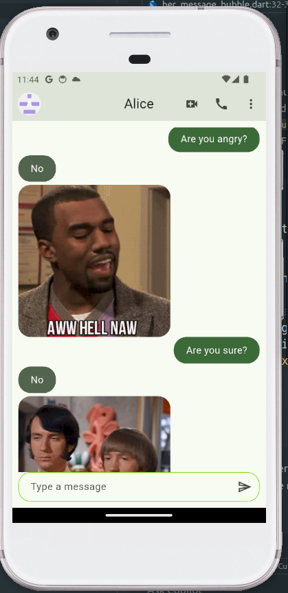

# theme_yes_app



theme_yes_app is a Flutter chat application that communicates with a simple yes/no API to generate text responses and optional image URLs. It demonstrates custom theming, state management, and dynamic UI rendering.

## How it Works

1. User enters a message and taps send.
2. The app makes an HTTP request to a yes/no API.
3. The API returns a text answer ("yes" or "no") and may include an image URL.
4. Messages are displayed in chat bubbles:
   - User messages are right-aligned with primary color.
   - AI responses are left-aligned with secondary color.
5. If an image URL is provided, it loads inside the response bubble with a progress indicator.

## Project Structure

- `lib/main.dart`: App entry point, theme setup and state providers.
- `lib/presentation/widgets/chat`: UI widgets for message bubbles (`HerMessageBubble`, `MyMessageBubble`).
- `lib/presentation/providers`: Provider classes managing chat state and API calls.
- `lib/domain/entities`: Core `Message` entity defining text, sender, timestamp, and optional imageUrl.
- `lib/infrastructure/models`: Data models for parsing API responses.
- `config/theme`: Definition of custom light/dark color schemes.
- `assets/`: Static assets (e.g., `ChatApp.png`).

## Getting Started

1. Clone the repository:
   ```bash
   git clone https://github.com/yourname/theme_yes_app.git
   ```
2. Navigate to project folder:
   ```bash
   cd theme_yes_app
   ```
3. Fetch dependencies:
   ```bash
   flutter pub get
   ```
4. Run the app on simulator or device:
   ```bash
   flutter run
   ```

## Commit History

- **Initial commit**: Flutter project scaffold created.
- **Chat UI**: Implement core chat interface with message bubbles.
- **State Management**: Added Provider for chat state and API integration.
- **Image Support**: Enabled optional image loading inside response bubbles.
- **Theming**: Applied custom color schemes and UI refinements.
- **Documentation**: Updated README with overview, usage, and commit history.
